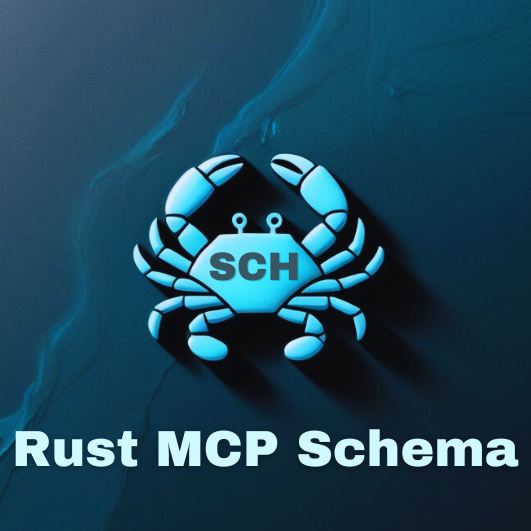

<p align="center">
  
</p>

# Model Context Protocol (MCP) Schema for Rust

[](https://crates.io/crates/rust-mcp-schema)
[](https://docs.rs/rust-mcp-schema/0.1.0)
[
](https://github.com/rust-mcp-stack/rust-mcp-schema/actions/workflows/ci.yml)

A type-safe Rust implementation of the official Model Context Protocol (MCP) schema, supporting all official released versions including `2025_06_18`, `2025_03_26`, `2024_11_05` and `draft` version for early adoption.

The MCP schemas in this repository are [automatically generated](#how-are-schemas-generated) from the official Model Context Protocol, ensuring they are always up-to-date and aligned with the latest official specifications.

---

**Note:** This crate **only** provides an implementation of the MCP schema.

 If you are looking for a high-performance, asynchronous toolkit for building MCP servers and clients, checkout [rust-mcp-sdk](https://crates.io/crates/rust-mcp-sdk).
Focus on your app's logic while [rust-mcp-sdk](https://crates.io/crates/rust-mcp-sdk) takes care of the rest!

---

## Contents:

- [Features](#features)
- [How can this crate be used?](#how-can-this-crate-be-used)

- [Schema Versions](#schema-versions)
  - [How to switch between different schema versions?](#how-to-switch-between-different-schema-versions)
  - [How are Schemas generated?](#how-are-schemas-generated)
- [What is `schema_utils`?](#what-is-schema_utils)
- [What does the schema_utils do?](#what-does-the-schema_utils-do)
- [Usage Examples](#usage-examples)
  - [Detecting an InitializeRequest Message on an MCP Server](#detecting-an-initializerequest-message-on-an-mcp-server)
  - [Creating an InitializeResult Response on an MCP Server](#creating-an-initializeresult-response-on-an-mcp-server)
  - [Detecting an InitializeResult Response Message in an MCP Client](#detecting-an-initializeresult-response-message-in-an-mcp-client)
- [Usage Examples (Without Utilizing schema_utils)](#usage-examples-without-utilizing-schema_utils)

  - [Detecting an InitializeRequest Message on an MCP Server (without schema_utils)](#detecting-an-initializerequest-message-on-an-mcp-server-without-schema_utils)

- [Contributing](CONTRIBUTING.md)

## Features

- 🧩 Type-safe implementation of the MCP protocol specification.
- 💎 Auto-generated schemas are always synchronized with the official schema specifications.
- 📜 Includes all official released versions : `2025_06_18`, `2025_03_26`, `2024_11_05` and `draft` version for early adoption.
- 🛠 Complimentary schema utility module (schema_utils) to boost productivity and ensure development integrity.

## How can this crate be used?

This Crate provides Rust implementation of the official Model Context Protocol (MCP) schema.

Model Context Protocol (MCP) is an open protocol that enables seamless integration between LLM applications and external data sources and tools. Whether you’re building an AI-powered IDE, enhancing a chat interface, or creating custom AI workflows, MCP provides a standardized way to connect LLMs with the context they need.

This crate includes the schema with `serialization` / `deserialization` support via serde_json, along with a minimal implementation of the necessary traits for structs and enums. This helps in creating and using various MCP messages such as requests, responses, notifications, and errors.

This crate could be used for developing an **MCP Server** or **MCP Client** in Rust.
For more information on the MCP architecture, refer to the [official documentation](https://spec.modelcontextprotocol.io/specification).

---

 Check out [rust-mcp-sdk](https://crates.io/crates/rust-mcp-sdk) , a high-performance, asynchronous toolkit for building MCP servers and clients which is based on `rust-mcp-schema`. Focus on your app's logic while [rust-mcp-sdk](https://crates.io/crates/rust-mcp-sdk) takes care of the rest!

---

## Schema Versions

This repository provides all official released versions the schema , including draft version, enabling you to prepare and adapt your applications ahead of upcoming official schema releases.

- [2025_06_18](src/generated_schema/2025_06_18)
- [2025_03_26](src/generated_schema/2025_03_26)
- [2024_11_05](src/generated_schema/2024_11_05)
- [draft](src/generated_schema/draft)

### How to switch between different schema versions?

By default, the latest version of the MCP Protocol schema is enabled.

Each schema version has a corresponding Cargo feature that can be enabled in your project's Cargo.toml.

Multiple schema versions may be enabled concurrently if needed. Non-default versions are available under explicitly named modules, for example:

- rust_mcp_schema::mcp_2024_11_05
- rust_mcp_schema::mcp_draft"

Example: enable `2024_11_05` version of the schema:

<!-- x-release-please-start-version -->

```toml
# Cargo.toml
rust-mcp-schema = { version: 0.7.5 , default-features = false, features=["2024_11_05"] }
```

Example: enable `draft`` version of the schema (2024_11_05) :

```toml
#Cargo.toml
rust-mcp-schema = { version: 0.7.5 , default-features = false, features=["draft"] }
```

<!-- x-release-please-end -->

## How are Schemas generated?

Schemas are generated from the official `schema.ts` and `schema.json` files available in the original [Model Context Protocol (MCP) repository](https://github.com/modelcontextprotocol/specification/tree/main/schema).

Using a customized version of [typify](https://github.com/oxidecomputer/typify), along with additional pre-processing and post-processing steps, the schema specifications are transformed into Rust code.

### 📌 Note

> The code used to generate schemas from `schema.ts` and `schema.json` is not included in this repository. However, I am considering making it available as a CLI tool in the future, allowing developers to generate MCP schemas as Rust code that can be directly integrated into their projects.

## What is `schema_utils`?

The Rust implementations of the MCP schemas in this crate are automatically generated from the official MCP GitHub repository.

[mcp_schema.rs](src/generated_schema/2024_11_05/mcp_schema.rs) provides all the core structures and enums with serialization/deserialization support, allowing you to use them as needed and extend their functionality.

To streamline development, improve compile-time type checking, and reduce the potential for errors, we’ve implemented utility types and functions that offer more strongly-typed objects and implementations, all without modifying the originally generated schema.

Please refer to [schema_utils.rs](src/generated_schema/2024_11_05/schema_utils.rs) for more details.

### 📌 Note

> Using schema_utils is optional. It is enabled by default through the schema_utils Cargo feature and can be used from `rust_mcp_schema::schema_utils`.

> If you prefer not to use schema_utils, you can directly work with the enums and structs provided in [mcp_schema.rs](src/generated_schema/2024_11_05/mcp_schema.rs), adapting them to your needs and creating your own utility types and functions around them.

Visit [Usage Examples (Without `Using schema_utils`)](#usage-examples-without-utilizing-schema_utils) to see an alternative approach.

### What does the schema_utils do?

The official schema defines a unified `JsonrpcMessage` type that encompasses all messages and notifications within the MCP protocol.

To enhance type safety and usability, `schema_utils` divides JsonrpcMessage into two distinct categories: `ClientMessage` and `ServerMessage`. Each category includes the relevant types for both standard and custom messages.

Please refer to [schema_utils.rs](src/generated_schema/2024_11_05/schema_utils.rs) and the [Usage Examples](usage-examples) section for more details.

## Usage Examples

:point_right: The following examples focus solely on the serialization and deserialization of schema messages, assuming the JSON-RPC message has already been received in the application as a string.

### Detecting an `InitializeRequest` Message on an MCP Server

The following code snippet demonstrates how an MCP message, represented as a JSON string, can be deserialized into a ClientMessage and how to identify it as an InitializeRequest message.

> Note: ClientMessage represents MCP messages sent from an MCP client. The following code demonstrates how an MCP server can deserialize received messages from an MCP client.

```rs

pub fn handle_message(message_payload: &str)->Result<Error> {

        // Deserialize message into ClientMessage.
        // ClientMessage is an enum defined in schema_utils.
        let message = ClientMessage::from_str(&message_payload)?;

        // Check if the message is a Request
        if let ClientMessage::Request(message_object) = message {

            // Check if it's a standard ClientRequest (not a CustomRequest)
            if let RequestFromClient::ClientRequest(client_request) = message_object.request {

                // Check if it's an InitializeRequest
                if let rust_mcp_schema::ClientRequest::InitializeRequest(initialize_request) = client_request {

                    // Process the InitializeRequest (and eventually send back a InitializedNotification back to the server)
                    handle_initialize_request(initialize_request);

                }
            }
        }

    }

```

Refer to [examples/mcp_server_handle_message.rs](examples/mcp_server_handle_message.rs) for a complete match implementation that handles all possible `ClientMessage` variants.

### Creating an `InitializeResult` Response on an MCP Server.

In response to an InitializeRequest, the MCP Server is expected to return an InitializeResult message.

This code snippet demonstrates how to create an InitializeRequest, serialize it into a string, and send it back to the client via the transport layer.

```rs
 // create InitializeResult object
   let initial_result = InitializeResult {
       capabilities: ServerCapabilities {
           experimental: None,
           logging: None,
           prompts: Some(ServerCapabilitiesPrompts {
               list_changed: Some(true),
           }),
           resources: Some(ServerCapabilitiesResources {
               list_changed: Some(true),
               subscribe: Some(true),
           }),
           tools: Some(ServerCapabilitiesTools {
               list_changed: Some(true),
           }),
       },
       instructions: Some(String::from("mcp server instructions....")),
       meta: Some(
           vec![
               ("meta 1".to_string(), Value::String("meta-value".to_string())),
               ("meta 2".to_string(), Value::Number(serde_json::Number::from(225))),
               ("feature-xyz".to_string(), Value::Bool(true)),
           ]
           .into_iter()
           .collect(),
       ),
       protocol_version: LATEST_PROTOCOL_VERSION.to_string(),
       server_info: Implementation {
           name: String::from("example-servers/everything"),
           version: String::from("1.0.0"),
       },
   };


    // Create a ServerMessage (a message intended to be sent from the server)
    let message: ServerMessage = initial_result.to_message(request_id).unwrap();

   // Serialize the MCP message into a valid JSON string for sending to the client
   let json_payload = message.to_string();

   println!("{}", json_payload);
```

output:

```json
{
  "id": 15,
  "jsonrpc": "2.0",
  "result": {
    "capabilities": {
      "prompts": { "listChanged": true },
      "resources": { "listChanged": true, "subscribe": true },
      "tools": { "listChanged": true }
    },
    "instructions": "mcp server instructions....",
    "_meta": { "feature-xyz": true, "meta 1": "meta-value", "meta 2": 225 },
    "protocolVersion": "2024-11-05",
    "serverInfo": { "name": "example-servers/everything", "version": "1.0.0" }
  }
}
```

### Detecting an `InitializeResult` Response Message in an MCP Client.

```rs
fn handle_message(message_payload: &str) -> std::result::Result<(), AppError> {
    // Deserialize message into ServerMessage.
    // ServerMessage represents a message sent by an MCP Server and received by an MCP Client.
    let mcp_message = ServerMessage::from_str(message_payload)?;

     // Check if the message is a Response type of message
     if let ServerMessage::Response(message_object) = mcp_message {

        // Check if it's a standard ServerResult (not a CustomResult)
        if let ResultFromServer::ServerResult(server_response) = message_object.result  {

            // Check if it's a InitializeResult type of response
            if let ServerResult::InitializeResult(server_response){
                 //Process the InitializeResult and send an InitializedNotification back to the server for acknowledgment.
                 handle_initialize_result(initialize_request);

            }
        }
     }
}
```

Refer to [mcp_client_handle_message.rs](examples/mcp_client_handle_message.rs) for a complete match implementation that handles all possible `ServerMessage` variants.

## Usage Examples (Without Utilizing `schema_utils`)

If you prefer not to use schema_utils, you can directly work with the generated types in your application or build custom utilities around them.

### Detecting an InitializeRequest Message on an MCP Server (without schema_utils)

The following code example illustrates how to detect an InitializeRequest message on an MCP server:

```rs

fn handle_message(message_payload: &str) -> std::result::Result<(), AppError> {

// Deserialize json string into JsonrpcMessage
    let message: JsonrpcMessage = serde_json::from_str(message_payload)?;

    // Check it's a Request type of message
    if let JsonrpcMessage::Request(client_message) = message {

        // Check method to detect is a "initialize" request
        if client_message.method == "initialize" {

            // Now that we can handle the message, we simply print out the details.
            println!("{} request received!", "initialize");

            if let Some(params) = client_message.params {
                // print out params meta
                println!("params.meta : {:?} ", params.meta);

                let params: InitializeRequestParams = serde_json::from_value(Value::Object(params.extra.unwrap())).unwrap();

                // print out InitializeRequestParams param values
                println!(
                    "client_info : {:?} \ncapabilities: {:?} \nprotocol_version: {:?}",
                    params.client_info, params.capabilities, params.protocol_version
                );
            }
        }
    }

    Ok(())
}
```

## Contributing

We welcome everyone who wishes to contribute! Please refer to the [contributing guidelines](CONTRIBUTING.md) for more details.

All contributions, including issues and pull requests, must follow
[Rust's Code of Conduct](https://www.rust-lang.org/policies/code-of-conduct).

Unless explicitly stated otherwise, any contribution you submit for inclusion in `rust-mcp-schema` is provided under the terms of the MIT License, without any additional conditions or restrictions.
